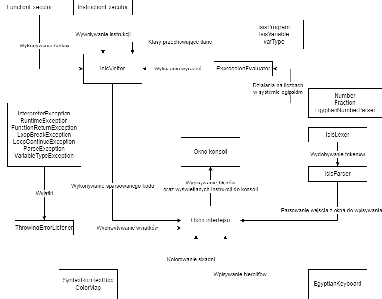
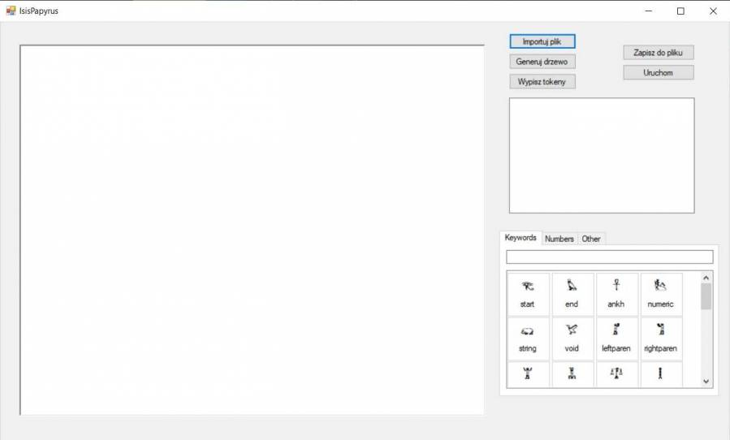
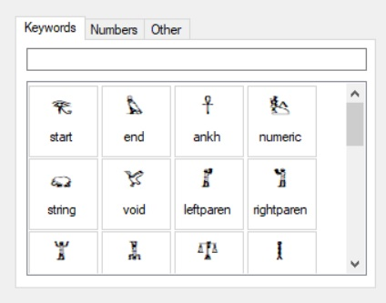
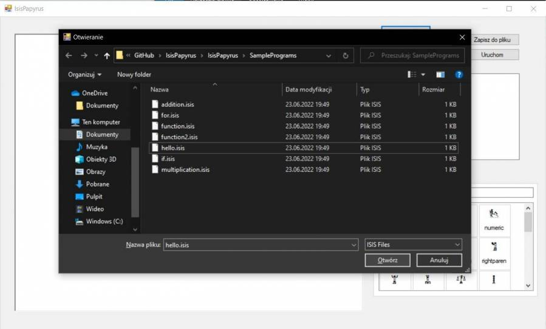
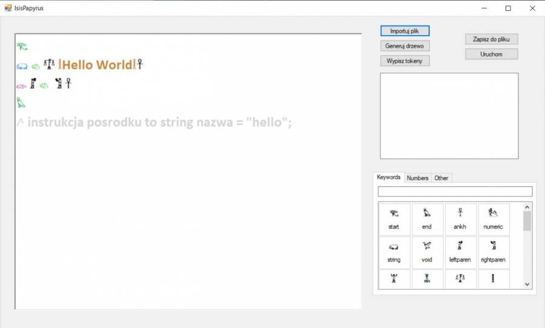
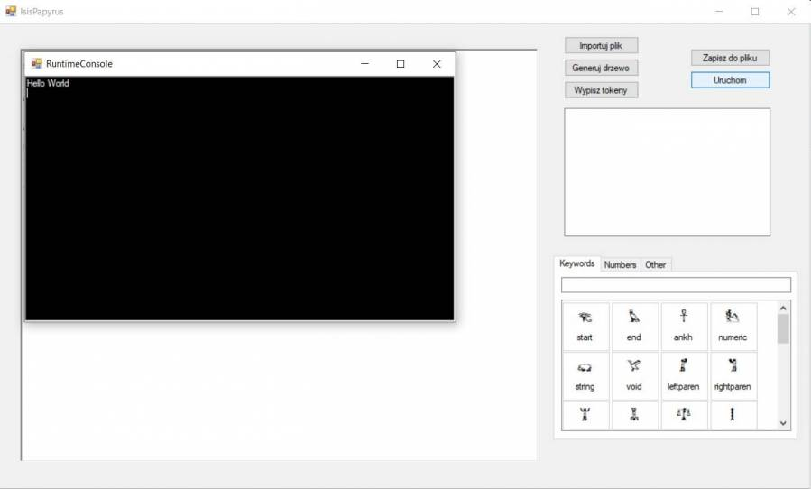

# Interpreter własnego języka opartego na hieroglifach egipskich

**Autorzy:**
- Bartłomiej Łaciak, email: blaciak@student.agh.edu.pl
- Kamil Bernacik, email: kbernacik@student.agh.edu.pl

**Główne cele i założenia projektu:**
- opis własnego języka opartego na hieroglifach o nazwie **Isis** (od imienia egipskiej bogini Izydy)
- stworzenie interpretera z interfejsem graficznym, uruchamiającego programy napisane w języku Isis
- wpisywanie hieroglifów z autorskiej klawiatury z poziomu interfejsu graficznego
- system liczbowy oparty na egipskim systemie liczbowym [Wikipedia][1]
- składnia języka oparta jest głównie na okrojonej wersji C
- implementacja interpretera w **C#** używając frameworku **WinForms** z platformy **.NET**
- używany generator parserów: **ANTLR** w wersji **4.10.1**

[1]: https://pl.wikipedia.org/wiki/Egipski_system_liczbowy "Egipski system liczbowy"

**Gramatyka**

Pliki gramatyk znajdują się w katalogu /IsisPapyrus/Grammar

**Schemat struktury programu**



Interfejs programu korzysta z kontrolek do kolorowania składni oraz klawiatury umożliwiającej wpisywanie hieroglifów. W celu wykonania kodu korzysta z wygenerowanych przez ANTLR klas IsisLexer oraz IsisParser, a następnie napisaną przez nas klasą IsisVisitor kod jest wykonywany linijka po linijce. IsisVisitor korzysta z pomocniczych klas FunctionExecutor, InstructionExecutor, ExpressionEvaluator oraz autorskich klas do obsługi egipskich liczb.

Wszelkie wyjątki i błędy wyświetlane są w konsoli.

**Stosowane narzędzia i technologie:**

- Program został napisany języku **C#** z zastosowaniem framework'u **.NET**
- Użyty interfejs graficzny (GUI) to **WinForms** który jest zawarty w .NET Framework
- Użytym środowiskiem programistycznym jest **Microsoft Visual Studio**
- Generatorem parserów jest **ANTLR**
- Kod utrzymywany jest w repozytorium na platformie **Github**

**Instrukcja obsługi oraz przykłady użycia**

Należy sklonować lub pobrać i rozpakować repozytorium. Następnie otworzyć Projekt w Microsoft Visual Studio (plik .sln w katalogu projektu). Po otwarciu trzeba projekt skompilować i uruchomić (przycisk F5 na klawiaturze).

Zostanie wyświetlone okno:


W tym momencie na ekranie możemy zacząć pisać program w hieroglifach, pomocnym do tego jest specjalna klawiatura:


Klawiatura jest podzielona na sekcje: **Keywords**, **Numbers** oraz **Other**. Pierwsza zawiera wszystkie słowa kluczowe potrzebne do zbudowania programu, druga system liczbowy, a trzecia inne hieroglify nieużywane jako słowa kluczowe, należy je użyć jako nazwy zmiennych. By wybrać z klawiatury hieroglif należy go wcisnąć kursorem dwukrotnie.

Przykładowy program w naszym języku może wyglądać tak:

```
𓂀
𓃯 𓄃 𓍝 𓎛Hello𓎛𓋹
𓅊
𓌅 komentarz
```

Program ten napisany w języku C (na którego składni się wzorowaliśmy) wyglądał by następująco:

```
#include <stdio.h>

int main(){
    string 𓄃 = "Hello";
    return 0;
}
// komentarz
```

Zamiast wpisywać w okno wszystkich znaków, można załadować gotowy program wciskając przycisk Importuj plik. Otworzony wtedy zostanie eksplorator plików systemu Windows w folderze z przykładowymi programami (które zostały pobrane wraz z repozytorium):


Należy wybrać pliki z rozszerzeniem **.isis**. Po załadowaniu pliku (np. hello.isis) zobaczymy wypisane wszystkie hieroglify programu:


Teraz możemy uruchomić nasz program.


Oprócz uruchomienia można również wygenerować drzewo, wypisać tokeny lub zapisać cały kod w hieroglifach do pliku .isis, do wszystkich tych opcji wykorzystujemy dostępne przyciski.

**Rozszerzenia programu**

Program w przyszłości może zostać rozszerzony o:
- typy tablicowe
- include (importowanie innych plików)
- typ logiczny (bool), typ jednoznakowy (char)
- możliwość tworzenia klas/struktur
- podpowiadanie składni podczas pisania

**Ograniczenia programu**

- Ze względu wykorzystania .NET Framework dla Windows Forms program może być uruchamiany jedynie na urządzeniach z system Microsoft Windows
- Obsługiwany jest tylko jeden plik jednocześnie
